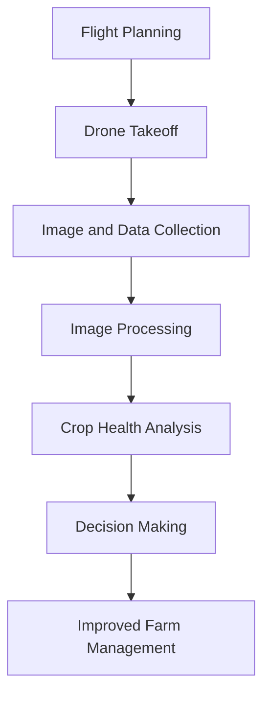
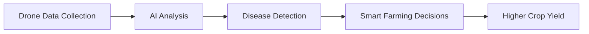

#  Application of UAVs in Precision Agriculture

> **Technical Resource Article**

---

##  Table of Contents

1. [Introduction](#introduction)
2. [Role of UAVs in Agriculture](#role-of-uavs-in-agriculture)
3. [UAV System Components](#uav-system-components)
4. [Workflow of UAV-Based Crop Monitoring](#workflow-of-uav-based-crop-monitoring)
5. [Key Applications](#key-applications)
6. [Advantages](#advantages)
7. [Challenges](#challenges)
8. [Future Scope](#future-scope)
9. [Conclusion](#conclusion)

---

# Introduction

> **Unmanned Aerial Vehicles (UAVs)**, commonly known as **drones**, are aircraft that operate without a human pilot on board.

They are controlled either:

- Remotely by a human operator
- Autonomously using onboard computers and GPS

In recent years, UAVs have become an important technology in **precision agriculture**.

Farmers use drones to:

- Monitor crop health  
- Improve agricultural productivity  
- Reduce water and fertilizer waste  

Using aerial images and sensor data, drones help farmers make **data-driven decisions** for better farm management.

# Role of UAVs in Agriculture

| Feature | Description |
|-------|-------------|
| **Aerial Monitoring** | Provides bird’s-eye view of large farms |
|  **Crop Health Analysis** | Detects disease and plant stress |
|  **Precision Spraying** | Applies fertilizer and pesticides accurately |
| **Field Mapping** | Generates high-resolution farm maps |
| **Resource Optimization** | Reduces water and chemical waste |

# UAV System Components

A typical agricultural drone contains the following components:

| Component | Function |
|-----------|-----------|
| **Frame** | Structure that holds all components |
| **Motors & Propellers** | Generate lift and movement |
| **Flight Controller** | Controls stability and navigation |
| **GPS Module** | Enables autonomous navigation |
| **Camera / Sensors** | Capture images and environmental data |
| **Battery** | Supplies power to the UAV |

## Workflow of UAV-Based Crop Monitoring

The process of using UAVs in agriculture follows these steps:

# Key Applications

##  Crop Health Monitoring

Drones equipped with **multispectral cameras** capture images that reveal variations in plant health.

### Common Indicators

- 🟢 **Green color** → Healthy crops  
- 🟡 **Yellow patches** → Nutrient deficiency  
- 🟤 **Brown spots** → Possible disease or pest damage  

> Early detection allows farmers to take corrective action before the damage spreads.

---

##  Irrigation Management

Thermal sensors help detect **water stress** in crops.

### Benefits

1. Efficient water usage  
2. Reduced water wastage  
3. Early detection of dry areas  

**Example workflow**

Drone Scan → Temperature Analysis → Dry Area Detection → Targeted Irrigation

---

## Precision Crop Spraying

Agricultural drones can spray fertilizers or pesticides accurately.

**Why drones are better**

- Faster than manual spraying  
- Reduces chemical usage  
- Ensures uniform distribution  

> Precision spraying reduces environmental impact and improves crop yield.

---

##  Field Mapping

Drones create digital maps of farmland for analysis and planning.

### Types of Maps Generated

- **2D Orthomosaic Maps**  
- **3D Terrain Models**  
- **NDVI Vegetation Maps**

---

#   Advantages of Using UAVs

### Key Advantages

-  Fast data collection across large farms  
-  Reduced labor costs  
-  Early disease detection  
-  Data-driven decision making  
- Sustainable farming practices  

---

#   Challenges and Limitations

> Despite their benefits, UAV technology still faces several challenges.

- **High Initial Cost**  
- **Limited Battery Life (20–40 minutes)**  
- **Need for Skilled Operators**  
- **Government Regulations**

---

#  Future Scope

Future developments in UAV agriculture may include:

-  **AI-based crop disease detection**
-  **Drone swarm farming**
-  **Real-time farm monitoring**
-  **Autonomous agricultural systems**

# Conclusion

UAVs are transforming traditional agriculture into smart farming systems.

Key impacts include:
Better crop monitoring,
Efficient resource use,
Higher agricultural productivity

As UAV technology continues to evolve, drones will become a core tool for modern precision agriculture.

